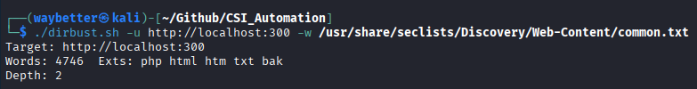
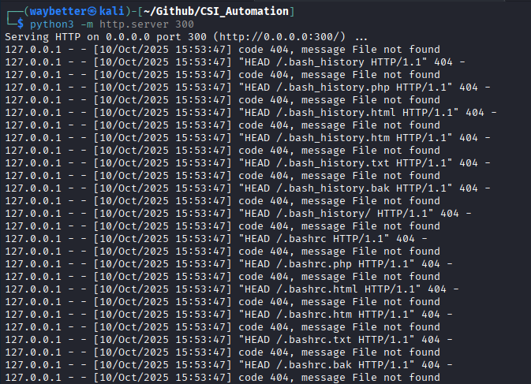
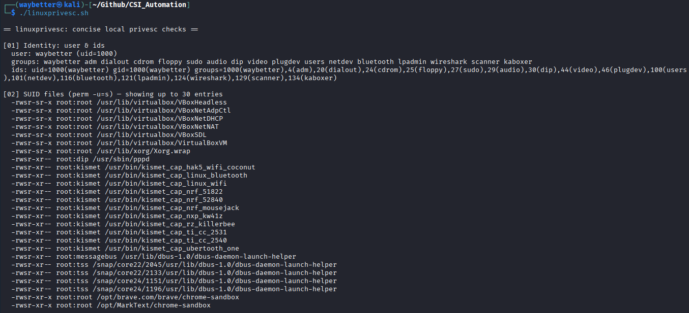
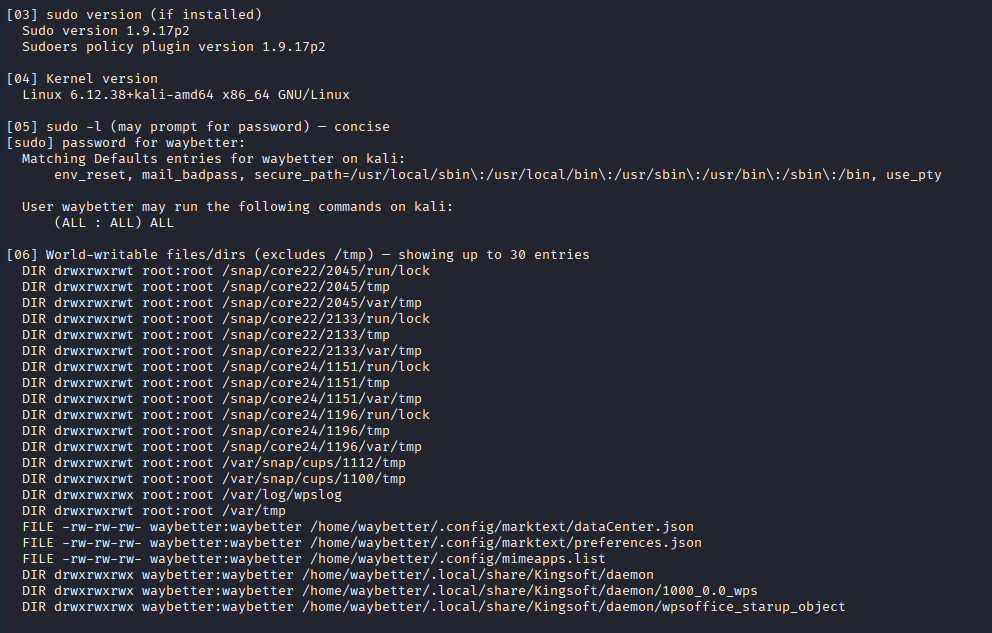
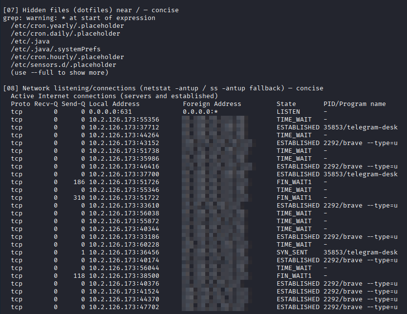
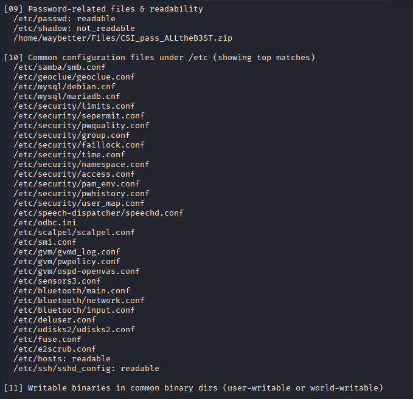

## Basic Usage:

### Directory buster [Recursion / Depth 2]

`./dirbust.sh TARGET_URL WORDLIST [ext1,ext2,...]`

##### Prerequisites:

curl -> `sudo apt install curl`

##### Proof of Work

### Linux Privesc Helper

`./linuxprivesc.sh`
OR
`./linuxprivesc.sh [--full]`

##### Prerequisites:

curl -> `sudo apt install curl`

##### Checks performed (concise):

- Identity & UID/GIDs
- SUID files (find / -perm -u=s ...)
- sudo version
- Kernel version
- sudo -l output (may prompt)
- World-writable files (excludes /tmp)
- Hidden dotfiles near /
- Network listening/connections (netstat or ss)
- Password files readability (/etc/passwd, /etc/shadow)
- Common configuration files under /etc
- Writable binaries in common bin dirs

##### Proof of Work

